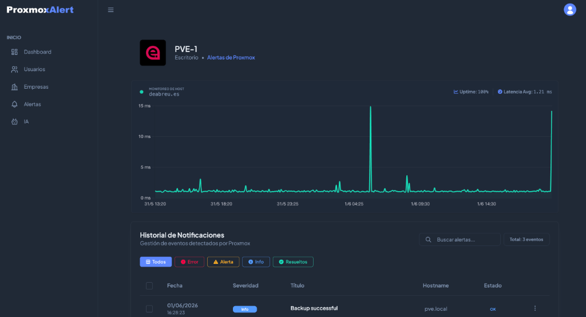

# ProxmoxAlert - Manual de Uso (v1.2)



Manual operativo y técnico para desplegar, configurar y usar **Proxmox Alert**.

## Tabla de contenidos
- [1. Descripción](#1-descripción)
- [2. Requisitos](#2-requisitos)
- [3. Instalación](#3-instalación)
- [4. Primer acceso](#4-primer-acceso)
- [5. Configuración SMTP](#5-configuración-smtp)
- [6. Gestión de empresas](#6-gestión-de-empresas)
- [7. Integración con Proxmox (Webhook)](#7-integración-con-proxmox-webhook)
- [8. Gestión de alertas](#8-gestión-de-alertas)
- [9. Resumen de Alertas con IA](#9-resumen-de-alertas-con-ia)
- [10. Usuarios, grupos y permisos](#10-usuarios-grupos-y-permisos)
- [11. Operación recomendada](#11-operación-recomendada)
- [12. Monitoreo de ping por cron (token interno)](#12-monitoreo-de-ping-por-cron-token-interno)
- [13. Resolución de problemas](#13-resolución-de-problemas)
- [14. Rutas principales](#14-rutas-principales)

## 1. Descripción
**Proxmox Alert** centraliza alertas de múltiples entornos Proxmox VE en una única interfaz web.

Capacidades principales:
- Alta y gestión de empresas/clientes.
- Recepción de eventos vía webhook.
- Clasificación de alertas por severidad.
- Resolución y borrado controlado de alertas.
- Envío de correo premium para alertas críticas con acceso directo.
- Resumen inteligente de alertas mediante IA (Gemini, ChatGPT, Ollama).
- Filtrado inteligente de ruido en el Dashboard (solo Warning/Error).
- Control de acceso por grupos y permisos.

## 2. Requisitos
- **PHP**: 8.2+
- **Framework**: CodeIgniter 4.7.x
- **Base de datos**: SQLite 3
- **Composer**
- Extensiones PHP habituales para CI4 (`intl`, `mbstring`, `json`, `pdo_sqlite`, etc.)

## 3. Instalación y Despliegue Manual (Recomendado)

Esta aplicación viene pre-empaquetada con todas sus dependencias (carpeta `vendor/` ya incluida), por lo que **no necesitas tener Composer instalado** en tu servidor. Sigue estos sencillos pasos para desplegar el panel:

### Paso 1: Clonar o descargar el código
Clona este repositorio o descarga el archivo `.zip` y colócalo en el directorio de tu servidor web (ej: `/var/www/proxmox-alert/`).

### Paso 2: Crear y configurar tu archivo `.env`
Duplica el archivo de plantilla `env` y llámalo `.env` en la raíz del proyecto:
```bash
cp env .env
```
Abre el archivo `.env` con un editor de texto y configura las siguientes propiedades clave:

1. **Entorno**: Establece el entorno en producción:
   ```env
   CI_ENVIRONMENT = production
   ```
2. **URL Base (`app.baseURL`)**: Modifícala con tu dominio web o IP real de acceso. **IMPORTANTE**: Debe comenzar con `http://` o `https://` y terminar obligatoriamente con una barra inclinada `/`:
   ```env
   app.baseURL = 'https://tudominio.com/'
   ```
3. **Base de Datos SQLite**: Indica la ruta absoluta hacia tu base de datos SQLite (se guardará dentro de `writable/`).

   Puedes ver tu ruta absoluta ejecutando el archivo `rutas.php` en tu navegador (ej: `https://tudominio.com/rutas.php`).

> [!WARNING]
> **NOTA: Por seguridad, elimina el archivo `rutas.php` de tu servidor una vez hayas configurado la ruta correcta.**

   ```env
   database.default.database = '/var/www/proxmox-alert/writable/database.db'
   database.default.DBDriver = 'SQLite3'
   ```
4. **Clave de Encriptación (`encryption.key`)**: Genera una clave aleatoria de 32 bytes de forma segura para encriptar los datos internos. Puedes usar este comando rápido para generar una compatible:
   ```bash
   php -r "echo 'hex2bin:' . bin2hex(random_bytes(32)) . PHP_EOL;"
   ```
   Y pégala en tu `.env`:
   ```env
   encryption.key = 'hex2bin:TU_CLAVE_GENERADA_AQUÍ'
   ```
5. **Token de Cron (`cron.pingToken`)**: Configura un token aleatorio y seguro para proteger tu endpoint de ping crons de accesos no autorizados. Puedes generar uno rápidamente ejecutando:
   ```bash
   php -r "echo bin2hex(random_bytes(16)) . PHP_EOL;"
   ```
   Copia el resultado y pégalo en tu `.env`:
   ```env
   cron.pingToken = 'TU_TOKEN_CRON_SEGURO'
   ```

### Paso 3: Permisos de Directorios
```bash
# Asignar permisos de lectura y escritura
sudo chmod -R 775 /var/www/proxmox-alert/writable
sudo chmod -R 775 /var/www/proxmox-alert/public/uploads
```

## 4. Primer acceso
Una vez configurado, abre tu navegador y entra en:
* `https://tudominio.com/`

Usa las credenciales de administrador iniciales:
* **Usuario**: `admin`
* **Email**: `admin@demo.com`
* **Contraseña**: `admin123`

> [!TIP]
> Por motivos de seguridad, te recomendamos encarecidamente cambiar tu nombre de usuario, email y contraseña en la pestaña **Perfil** de la barra lateral inmediatamente después de tu primer inicio de sesión.

## 5. Configuración de Canales de Alerta (Email, Telegram, Slack)
Ruta:
- `https://tudominio.com/alerts-config`

El sistema soporta la emisión simultánea de alertas críticas a través de 3 canales globales:

1. **Email (SMTP)**: Envía un correo con diseño premium a las empresas.
2. **Telegram**: Notifica instantáneamente mediante un Bot a un Grupo o Chat específico de la plataforma.
3. **Slack**: Envía alertas con diseño estructurado a un canal vía Incoming Webhooks.

Flujo recomendado:
1. Completar la configuración de los canales deseados (incluye instrucciones guiadas paso a paso en la propia interfaz).
2. Utilizar los botones de "Probar..." presentes en cada pestaña para verificar la conectividad y formato de los mensajes.
3. Guardar la configuración definitiva usando el botón principal "Guardar Configuración".

Notas:
- El sistema filtrará automáticamente el "ruido" y solo enviará notificaciones por estos canales cuando detecte incidencias de severidad importante (warning, error, critical, etc.).
- Las alertas puramente informativas (`info`, `notice`, `debug`) se guardan en el sistema pero no generan notificaciones push o email.
- Esta sección está restringida a grupos `admin` y `superadmin`.

## 6. Gestión de empresas
Ruta principal:
- `https://tudominio.com/companies`

Datos relevantes al crear/editar:
- `nombre` (obligatorio)
- `email` (recomendado si se activan notificaciones)
- `proxmox_host` (IP/hostname del host Proxmox a monitorear por ping)
- `active` (empresa habilitada)
- `send_email` ("Alertas por email", activa el envío automático de correo)
- `ai_enabled` ("Resumen IA", activa el análisis de incidentes por IA, encendido por defecto al crear)

Comportamiento:
- El sistema genera automáticamente un `webhook_token` único por empresa.
- En edición de empresa (`/companies/edit/{id}`) se puede ejecutar un ping manual con el botón `Ping`.

## 7. Integración con Proxmox (Webhook)
Endpoint receptor:
- `POST /webhook/proxmox/{token}`

Ejemplo local:
- `https://tudominio.com/webhook/proxmox/TOKEN_EMPRESA`

Por empresa se puede:
- Descargar script de configuración (`/companies/download-script/{id}`).
- Ver script en texto plano (`/companies/get-script/{id}`).
- Realizar un diagnóstico rápido abriendo la URL del Webhook en el navegador (petición `GET`) para verificar conectividad y estado de la empresa.

Formato JSON aceptado:
- Payload en raíz.
- Payload dentro de `body`.

Campos esperados:
- `title`
- `message`
- `severity`
- `timestamp`
- `hostname` o `node`

### Integración con ProxMenux
El sistema es plenamente compatible con ProxMenux a traves de **Apprise**, lo que facilita el envío directo de alertas desde herramienta.

1. **ProxMenux**:
   Puedes configurar los disparos de alerta en tiempo real directamente desde **[ProxMenux](https://github.com/MacRimi/ProxMenux)**.

2. **Obtención del enlace**:
   * Ve al listado de **Empresas** en la barra lateral.
   * Haz clic en el menú de acciones (`...`) de la empresa correspondiente.
   * Selecciona **Copiar URI de Apprise**.
   * El sistema copiará automáticamente al portapapeles una dirección con el formato compatible para Apprise utilizando el protocolo `jsons://`:
     `jsons://tudominio.com/webhook/proxmox/TOKEN_EMPRESA`

3. **Configuración**:
   * Pega esta URI en la sección de notificaciones de Apprise en ProxMenux.
   * ¡Listo! Los incidentes se recibirán y categorizarán de forma totalmente transparente e instantánea en el panel.

## 8. Gestión de alertas
Desde la vista de empresa:
- Filtrado por severidad y estado.
- Marcar alerta como resuelta.
- Borrado individual o masivo.

Reglas de borrado:
- No se elimina una alerta crítica pendiente.
- Se permite eliminar alertas en estado `resolved`.
- Se permite eliminar alertas informativas (`info`, `notice`, `debug`).

Reglas de Notificaciones Automáticas (Email, Telegram, Slack):
- Se envían alertas push (Telegram/Slack) de forma global solo si están explícitamente habilitados en su configuración.
- Se envía alerta por Email a la empresa si el canal SMTP está configurado correctamente.
- Solo se notificarán incidencias que contengan severidades importantes: `error`, `critical`, `warning`, `unknown`, `emergency`, `alert`, `crit`, `emerg`.
- Las notificaciones son limpias: omiten logs largos (Detalle técnico) y proveen un enlace directo de "Ver Detalles" para visualizar el error y el Análisis IA dentro del portal web.

## 9. Resumen de Alertas con IA
Ruta de configuración:
- `https://tudominio.com/ai`

Capacidades:
- **Proveedores**: Soporte para Google Gemini (vía OpenAI Compatible API), OpenAI ChatGPT y Ollama (Local).
- **Consolidación**: Convierte logs técnicos extensos en un resumen legible de máximo 2 frases en español.
- **Robustez**: Limpieza automática de "pensamientos" (thought tags) de modelos de razonamiento (ej: DeepSeek-R1).
- **Timeouts Optimizados**: Tiempo de espera de hasta 60s para garantizar respuestas de modelos complejos.

Configuración:
1. Ir al panel de **IA** y configurar el proveedor.
2. Usar el botón **Probar Generación** para validar la conectividad.
3. En la gestión de **Empresa**, activar el switch **Resumen IA**.

Visualización:
- **Dashboard**: Solo se notifican visualmente estados de Warning y Error para evitar ruido informativo.
- **Detalle**: Bloque destacado con el resumen completo dentro del modal de la alerta.
- **Email**: Notificaciones premium con botón de acceso directo al análisis de IA en el panel.

## 10. Usuarios, grupos y permisos
Rutas clave:
- `/users`
- `/users/create`
- `/users/edit/{id}`
- `/users/perfil`

Control de acceso:
- Autenticación por sesión.
- Permisos por acción (por ejemplo: `users.view`, `empresas.edit`).
- Restricciones por grupo para áreas sensibles.

Recomendación:
- Aplicar principio de mínimo privilegio en cada perfil.

## 11. Operación recomendada
1. Revisar alertas nuevas al inicio del turno.
2. Marcar incidencias cerradas como `resolved`.
3. Limpiar alertas informativas antiguas.
4. Verificar SMTP de forma periódica.
5. Revisar usuarios activos y permisos.
6. **Backups:** El motor de base de datos es SQLite. Toda la información reside localmente en `writable/database.db`. Para realizar un backup completo, simplemente haz una copia de seguridad de dicho archivo junto con la carpeta de imágenes en `public/uploads/`.

## 12. Monitoreo de ping por cron (token interno)
El sistema incluye un endpoint interno para ejecutar un chequeo masivo de ping y monitorear la disponibilidad en tiempo real de todas las empresas activas con `proxmox_host` configurado.

Configuración en `.env`:
- `cron.pingToken = 'TOKEN_LARGO_Y_SEGURO'`

Endpoint:
- `GET /monitoring/ping-check/{token}`

Ejemplo:
- `https://tudominio.com/monitoring/ping-check/TU_TOKEN`

Qué hace:
- **Prueba de Red y Latencia**: Recorre las empresas activas con host configurado, ejecuta una consulta por ping y calcula la latencia exacta de respuesta (soportando formatos de consola Linux y macOS/Darwin).
- **Historial de Disponibilidad (`ping_logs`)**: Almacena cada evento en base de datos para medir el porcentaje de disponibilidad (Uptime %) e histórico de latencias.
- **Autolimpieza (Anti-Bloat)**: Para mantener la base de datos SQLite ligera y rápida, el cron elimina automáticamente los logs de ping con más de **7 días de antigüedad** en cada ejecución.
- **Gestión Inteligente de Alertas**:
  - Si el host falla, crea una alerta de severidad crítica (`error`) con la descripción del incidente.
  - Si el host se recupera, cambia automáticamente el estado de la alerta anterior a `resolved` (resuelto) e inyecta la marca de tiempo de recuperación.
  - Posee deduplicación de eventos en cola para evitar saturar el historial mientras la caída permanezca activa.
- **Métricas & Gráficos Premium (UI)**: 
  * En la vista de detalle de cada empresa (`/companies/view/{id}`), se incorpora un panel de telemetría de ancho completo muy compacto y premium.
  * **Header integrado**: Muestra el host con un LED parpadeante dinámico de estado (online/offline), métricas de **Uptime %** (calculado sobre las últimas 100 pruebas) y **Latencia Media** representadas en texto limpio y minimalista integrado en el color del título general.
  * **Gráfico Neon y Relleno de Caídas (Chart.js)**: Un gráfico detallado que representa la variación de latencia de las últimas 100 pruebas con sombreado neon, y rellena hermosamente en rojo translúcido los intervalos en donde no hubo conectividad (caídas de ping), adaptándose dinámicamente al tema claro u oscuro del usuario.

Respuesta del Endpoint:
- Devuelve un JSON resumido: `total`, `ok`, `failed`, `alerts_created`, `alerts_skipped`, `alerts_resolved`.

Uso recomendado en hosting (Cron):
1. Crear una tarea programada en tu hosting (ej: cPanel Cron) cada 5 minutos.
2. Ejecutar una llamada HTTP GET al endpoint con tu token de seguridad.

Seguridad:
- Mantener el token solo en el archivo `.env`.
- Rotar el token si se comparte o filtra.
- No publicar el enlace en lugares públicos.

## 13. Resolución de problemas
**No llegan alertas**
- Verificar empresa activa.
- Confirmar token de webhook.
- Validar conectividad de red entre Proxmox y la URL del sistema.

**No llegan correos**
- Revisar configuración SMTP en `/email`.
- Ejecutar prueba SMTP.
- Confirmar `send_email` activo y email válido en la empresa.

**No se puede iniciar sesión**
- Confirmar ejecución de migraciones y seeders.
- Revisar credenciales iniciales.

**El cron de ping no crea alertas**
- Verificar `cron.pingToken` en `.env`.
- Confirmar que la URL del cron usa exactamente ese token.
- Revisar que la empresa esté activa y tenga `proxmox_host` configurado.
- Confirmar que el hosting permite ejecutar `ping` desde el servidor web.

## 14. Rutas principales
- `GET /login`
- `GET /companies`
- `GET /companies/create`
- `GET /companies/edit/{id}`
- `GET /companies/view/{id}`
- `GET /companies/download-script/{id}`
- `GET /companies/get-script/{id}`
- `GET /companies/ping?host=IP_O_HOSTNAME` (ping manual desde UI)
- `POST /webhook/proxmox/{token}`
- `GET /monitoring/ping-check/{token}` (cron interno)
